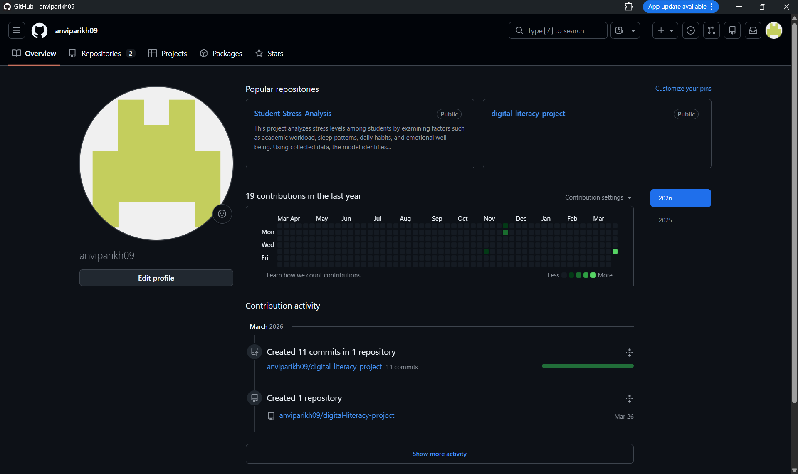
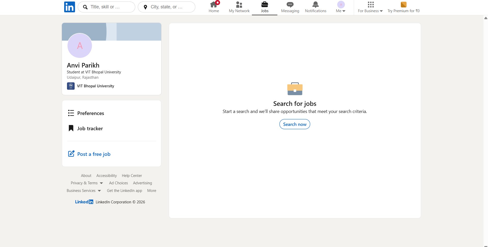
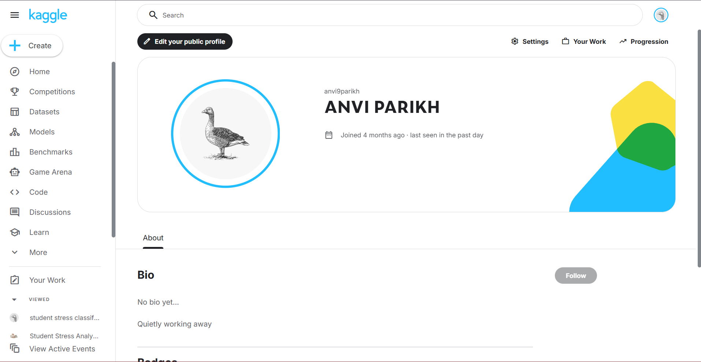

# Task 2: Digital Portfolio

This folder contains screenshots of my digital profiles created as part of the Digital Literacy project.

## Platforms Used
- GitHub – for storing and managing projects  
- LinkedIn – for building a professional network  
- Kaggle – for learning data science  

## Profile Screenshots

### GitHub

### LinkedIn

### Kaggle

