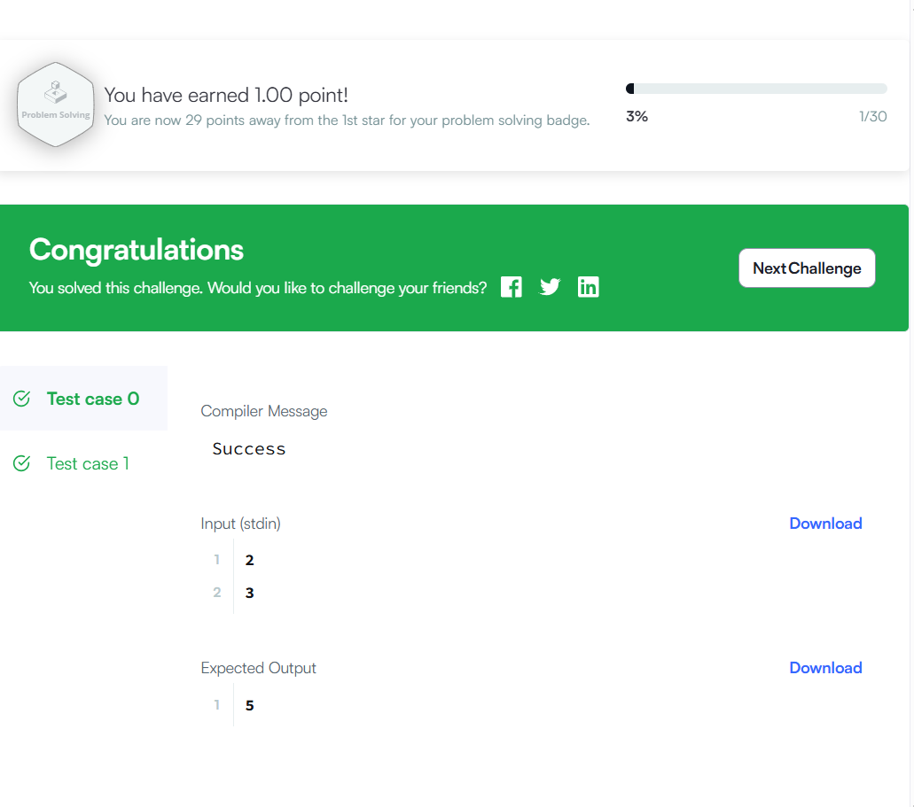
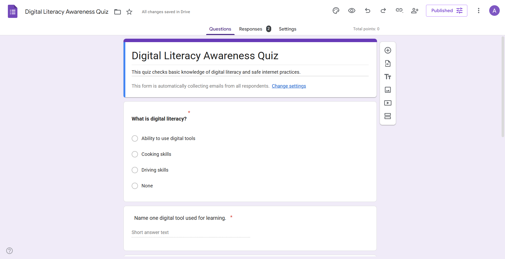
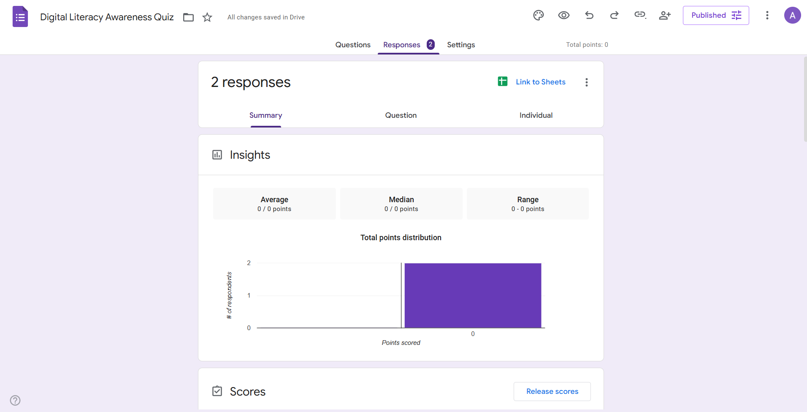

# Task 3: Coding & Collaboration Platforms

This folder contains my work for Task 3 of the Digital Literacy project.

## Coding Practice
I completed a beginner-level coding problem on HackerRank titled "Solve Me First". This helped me understand basic programming concepts like input, output, and functions.

## Google Form Quiz
I created a Digital Literacy Awareness Quiz using Google Forms. The quiz includes multiple-choice and short-answer questions to test basic knowledge of digital tools and safe internet practices. [Click here to view the Google Form](https://forms.gle/z9yN47vxtCjiL4Sr5)

## ## Screenshots
 Screenshot of completed coding problem 
 Screenshot of the Google Form  
 Screenshot of quiz responses with scores
